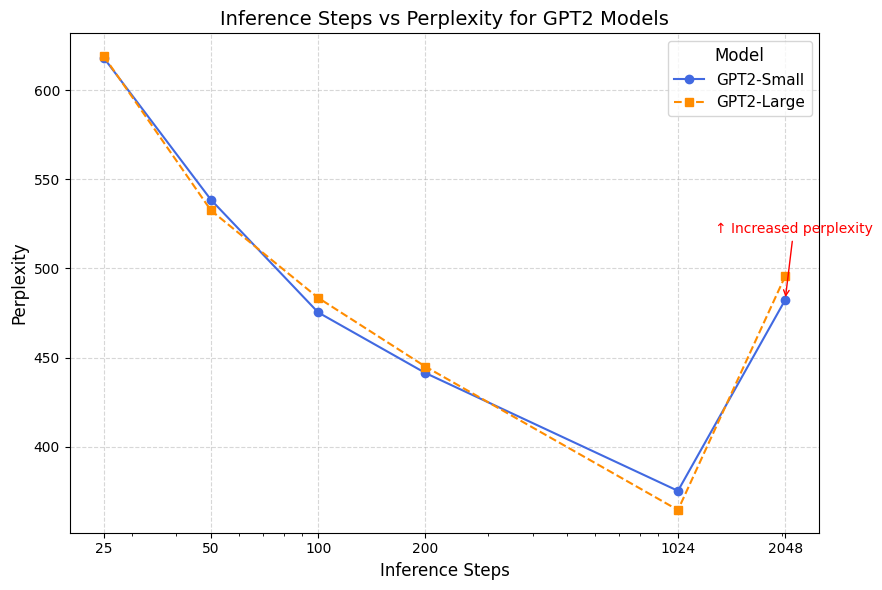
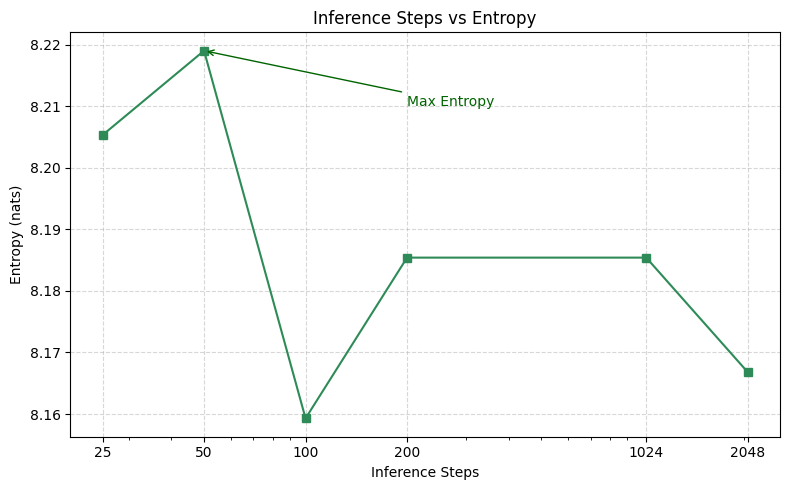

# Discrete Flow Matching (Unofficial PyTorch Implementation)

> 🔬 Unofficial implementation of the paper:  
> [**Discrete Flow Matching** (2024)](https://arxiv.org/abs/2407.15595)

  

## 📌 Overview

This repository provides an unofficial implementation of **Discrete Flow Matching (DFM)** using **PyTorch** and the **Hugging Face Accelerate** library.  
The model is trained on the **WikiText-103** dataset.

---

## 📈 Results

### Perplexity vs Sampling Steps

  

### Entropy vs Sampling Steps

  

---

## 🎥 Additional Sampling Visualizations

  

---

## 🛠️ Setup & Usage

Just run [`dfm_text.ipynb`](./dfm_text.ipynb).